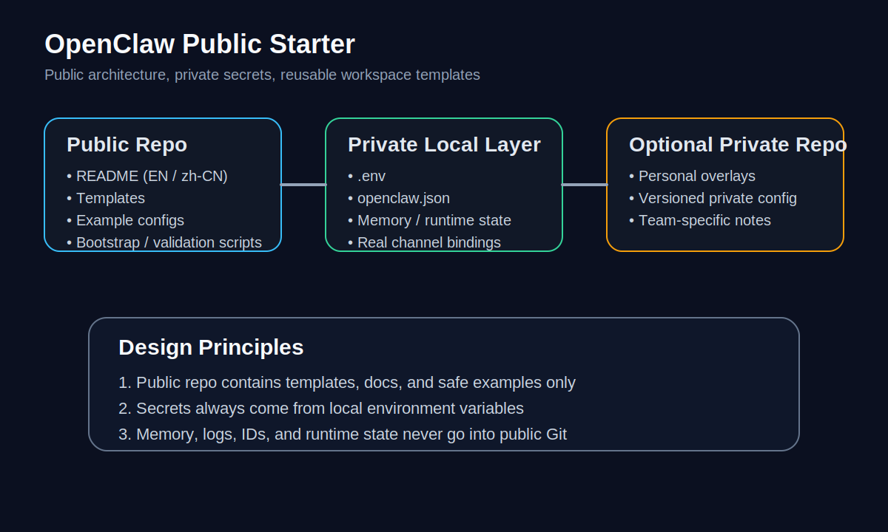

# OpenClaw Starter (Public)

A reusable public starter for OpenClaw setups.



A clean starter repo for people who want to open-source their OpenClaw structure without leaking personal context, secrets, or runtime state.

## What This Repo Gives You
- reusable architecture
- workspace templates
- example config
- bootstrap scripts
- privacy-first documentation
- a clean public foundation for your own OpenClaw setup

## What This Repo Deliberately Excludes
- personal memory
- private tokens / API keys
- real chat bindings
- personal device info
- runtime state
- live production deployment data

## Who This Is For
- People who want a reusable OpenClaw architecture repo
- Teams who need a public-safe starter before layering private config
- Builders who want a clean split between templates and secrets

## Who This Is Not For
- Anyone trying to publish a live production OpenClaw directory as-is
- Anyone who wants to store runtime memory, logs, or secrets in public Git

## Quick Start

```bash
git clone https://github.com/fufuandfoufou/openclaw-public-starter.git
cd openclaw-public-starter
./bootstrap.sh
```

## One-Command Install

```bash
curl -fsSL https://raw.githubusercontent.com/fufuandfoufou/openclaw-public-starter/main/install.sh | bash
```

## 30-Second Mental Model
Public repo = templates, docs, scripts.

Private local layer = `.env`, real `openclaw.json`, runtime memory, logs, real channel bindings.

That split is the whole point of this project.

## What You Need To Fill In
- `.env`
- your own `openclaw.json`
- your own channel bindings
- your own private workspace notes

## Repository Layout

```text
openclaw-starter-public/
├─ README.md
├─ README.zh-CN.md
├─ LICENSE
├─ CONTRIBUTING.md
├─ .env.example
├─ openclaw.example.json
├─ bootstrap.sh
├─ install.sh
├─ Makefile
├─ docs/
├─ scripts/
├─ agents/
├─ workspaces/
└─ skills/
```

## Included Docs
- `docs/architecture.md`
- `docs/privacy-model.md`
- `docs/release-checklist.md`
- `docs/project-positioning.md`
- `docs/faq.md`
- `SECURITY.md`

## Included Scripts
- `bootstrap.sh` — initialize local starter files
- `install.sh` — clone + bootstrap helper
- `scripts/validate-config.sh` — basic config presence checks
- `scripts/doctor.sh` — simple secret-pattern scan

## Privacy Model
This repo is designed as a **public starter**, not a dump of a live OpenClaw instance.

Keep these private:
- all tokens and API keys
- user / chat ids
- memory files
- logs and runtime state
- personal notes and device details

See `docs/privacy-model.md` for details.

## Recommended Workflow
1. Clone this public repo
2. Copy `.env.example` to `.env`
3. Copy `openclaw.example.json` to your local config
4. Fill in your own secrets locally
5. Customize agents and workspaces from templates
6. Run validation before publishing changes

## Publish Checklist
Before pushing publicly:

```bash
make validate
make doctor
```

Then review `docs/release-checklist.md`.

## FAQ
See `docs/faq.md`.

## Security
See `SECURITY.md`.

## License
MIT
